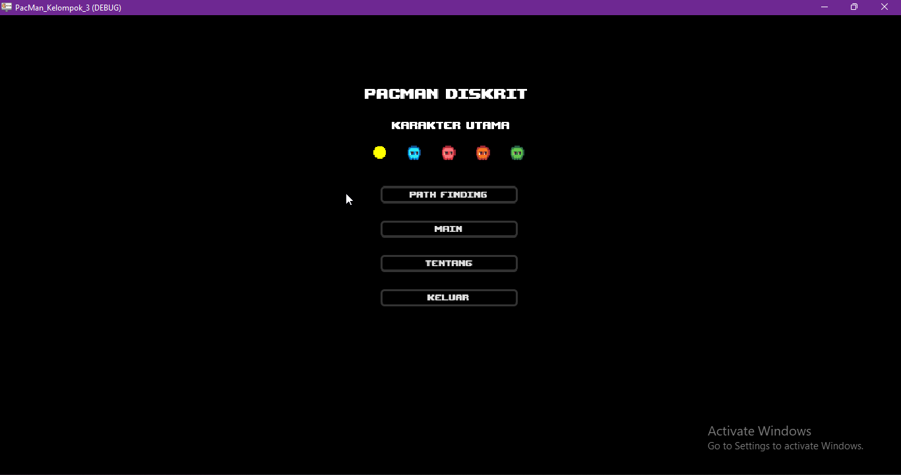

# Pacman Diskrit - Final Project Group 3




## 📖 About The Project

This repository contains the source code and executable for our group final project in the **Discrete Structures II (Struktur Diskrit II)** course at **Universitas Sriwijaya**.

This project re-imagines the classic **Pacman** game to demonstrate practical applications of **Graph Theory**. Unlike standard games, the enemy AI (Ghosts) in this project is driven by a custom implementation of the **Breadth-First Search (BFS)** algorithm to calculate the shortest path in an unweighted grid graph.

### Key Features
* 🧠 **Path Finding Visualization:** A specific mode to visualize how the algorithm scans the grid (visited nodes) and calculates the shortest path from the Ghost to Pacman in real-time.
* 📊 **Math Proof Console:** A unique feature that outputs calculation metrics (Time Complexity & Path Distance) to the debug console for academic verification.
* 🕹️ **Playable Game:** Fully functional Pacman mechanics with scoring, win/loss states, and smart enemies.
* ✅ **Godot Engine Power:** Built using Godot 4.5 for optimized 2D performance.

---

## 👥 The Team (Group 3)

| Name | Student ID (NIM) | Role |
| :--- | :--- | :--- |
| **Azizul Manal Gaumalanga** | 09021282429092 | Developer |
| **Stevanus Parise Jona Sitorus** | 09021282429109 | Developer |
| **Fathir Alif** | 09021282429112 | Developer |
| **Anugerah Prima** | 09021282429117 | Developer |

---

## 🧠 Algorithm & Logic

The core of this project is the **Breadth-First Search (BFS)** implementation found in `ghost_test.gd`. This algorithm ensures that the Ghost always finds the optimal path to the player.

### 1. BFS Implementation (GDScript)

We use a Queue-based approach to explore the grid layer-by-layer. Berikut potongan fungsi BFS yang telah diperbarui:

```gdscript
func find_path_bfs(start_node: Vector2i, target_node: Vector2i) -> Vector2i:
    if start_node == target_node:
        return start_node

    if wall == null:
        return start_node

    var queue: Array = []
    queue.append(start_node)

    var came_from := {}
    came_from[start_node] = null

    var found_target: bool = false

    while queue.size() > 0:
        var current: Vector2i = queue[0]
        queue.remove_at(0)

        if current == target_node:
            found_target = true
            break

        for neighbor in _bfs_get_neighbors(current):
            if not came_from.has(neighbor):
                came_from[neighbor] = current
                queue.append(neighbor)

    if not found_target:
        return start_node

    var curr: Vector2i = target_node
    while true:
        var parent = came_from[curr]
        if parent == start_node:
            return curr
        if parent == null:
            return start_node
        curr = parent
```

### 2. Mathematical Proof (Console Output)

To satisfy the course requirements, the game outputs a diagnostic report every time a path is found. This proves the algorithm’s efficiency:

```text
╔════════════════════════════════════════════════════╗
║      ⚡ BFS ALGORITHM DIAGNOSTICS ⚡               ║
╠════════════════════════════════════════════════════╣
║ ◈ STATUS        : TARGET ACQUIRED                  ║
╠════════════════════════════════════════════════════╣
║ 📍 COORDINATES                                     ║
║    • Ghost (Start)    : (5, 4)                     ║
║    • Player (Goal)    : (12, 8)                    ║
╠════════════════════════════════════════════════════╣
║ 📊 METRICS                                         ║
║    • Time Complexity : 142 Node (Visited/Scanned)  ║
║    • Shortest Path   : 18 Steps (Distance)         ║
╚════════════════════════════════════════════════════╝
```

---

## 🎮 Controls

| Action | Input Key |
| :--- | :--- |
| **Move Up** | `Arrow Up` / `W` |
| **Move Down** | `Arrow Down` / `S` |
| **Move Left** | `Arrow Left` / `A` |
| **Move Right** | `Arrow Right` / `D` |
| **Select Menu** | `Mouse Click` |

---

## 📥 Download & Installation
### 🪟Window
You can download the latest executable build for Windows from the link below:

#### 🚀 **DOWNLOAD PACMAN DISKRIT v1.0**

👉 **Mediafire:**  
https://www.mediafire.com/file/c8eozem2og2nt46/Pacman.zip/file

##🌐Web Version
You can play direcly through the web browser by clicking the link below:

👉 **Replit:**  


### 🛠️ How to Run (Source Code)

1. **Clone this repository:**
    ```bash
    git clone https://github.com/username/repo-name.git
    ```
2. **Open in Godot:**
    - Launch **Godot Engine 4.5**
    - Click **Import** and select the `project.godot` file  
    - Press **F5** to run

---

## 📄 License

Distributed under the MIT License.  
See `LICENSE` for more information.

---

**Informatics Engineering - Semester 3-Class L3-Group 3-2025** 
**Final Project**
**Discrete Structures II** 
**Universitas Sriwijaya (UNSRI)**
